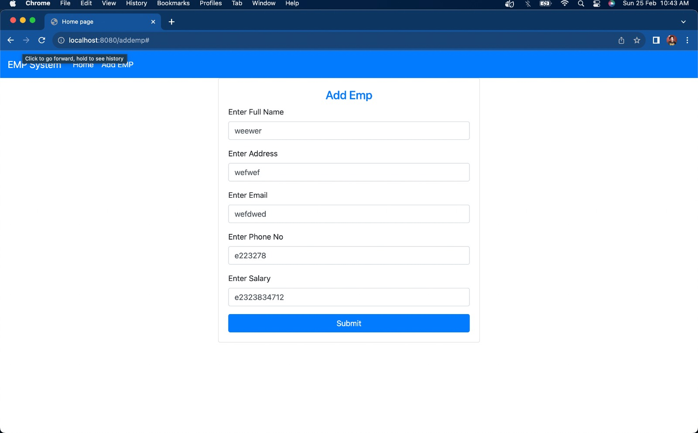

# CURD Application

## Introduction
The Java Spring Boot CRUD Application with Thymeleaf, Data JPA, and MySQL Integration is developed to streamline the management of data records. This application adheres to the CRUD (Create, Read, Update, Delete) principles, providing users with a user-friendly interface for seamless interaction with data stored in a MySQL database. By utilizing Spring Boot, Thymeleaf for the front-end, and Data JPA for simplified database operations, this application ensures efficient data manipulation while incorporating security measures.

## Usage
1.  Creating Records.
2.  Reading Records.
3.  Updating Records.
4.  Deleting Records.

## Overview



## Getting Started
To run the project locally, follow these steps:

1. Clone the repository.
2. Navigate to the project directory.
 ``` bash 
  3. run  EmployeeStystemAppilcation.java file
 ```


## Dependencies
- mySQL Driver.
- SpringBoot Dev tools.
- Spring data JPA.
- Spring Web.
- Thymeleaf.

## Further Enhancements
- Search Functionality.
- User Authentication.
- Audit Trails.
- Internationalization.

## Contribution
Contributions are welcome! Feel free to submit issues or pull requests.


